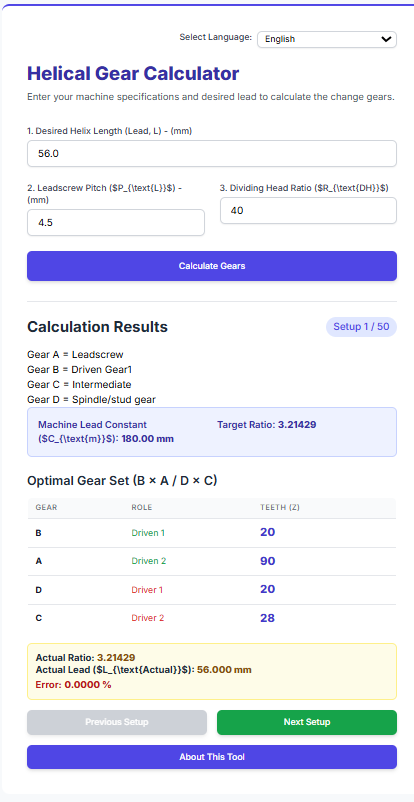

# Helical Gear Calculator


A web-based calculator for determining the correct change gears when cutting helical gears on a manual milling machine with a dividing head.

 <!-- Add your screenshot here -->

## 🚀 Features

- **Instant Calculation**: Input your machine specs and get optimal gear sets instantly
- **Error Validation**: Shows actual lead and percentage error for precision work
- **Standard Gear Sets**: Uses common gear tooth combinations (20, 28, 30, 35, 40, 45, 50, 55, 60, 65, 70, 75, 80, 90, 100)
- **Responsive Design**: Works on desktop and mobile devices

## 🛠️ Usage

1. **Enter Desired Lead**: Input the helical lead you want to achieve (in mm)
2. **Set Machine Parameters**: 
   - Leadscrew Pitch (typically 4-5 mm for metric machines)
   - Dividing Head Ratio (usually 40:1)
3. **Get Results**: The calculator displays:
   - Optimal 4-gear combination (A, B, C, D)
   - Actual achieved lead and error percentage
   - Machine lead constant

### Example
```yaml
Input:
- Desired Lead: 56.0 mm
- Leadscrew Pitch: 4.5 mm  
- Dividing Head Ratio: 40

Output:
- Gear Set: 20 × 90 / 20 × 28
- Actual Lead: 56.000 mm
- Error: 0.000%

MIT License

Copyright (c) 2024 [HanLinHtet]

Permission is hereby granted, free of charge, to any person obtaining a copy
of this software and associated documentation files (the "Software"), to deal
in the Software without restriction, including without limitation the rights
to use, copy, modify, merge, publish, distribute, sublicense, and/or sell
copies of the Software, and to permit persons to whom the Software is
furnished to do so, subject to the following conditions:

The above copyright notice and this permission notice shall be included in all
copies or substantial portions of the Software.

THE SOFTWARE IS PROVIDED "AS IS", WITHOUT WARRANTY OF ANY KIND, EXPRESS OR
IMPLIED, INCLUDING BUT NOT LIMITED TO THE WARRANTIES OF MERCHANTABILITY,
FITNESS FOR A PARTICULAR PURPOSE AND NONINFRINGEMENT. IN NO EVENT SHALL THE
AUTHORS OR COPYRIGHT HOLDERS BE LIABLE FOR ANY CLAIM, DAMAGES OR OTHER
LIABILITY, WHETHER IN AN ACTION OF CONTRACT, TORT OR OTHERWISE, ARISING FROM,
OUT OF OR IN CONNECTION WITH THE SOFTWARE OR THE USE OR OTHER DEALINGS IN THE
SOFTWARE.

